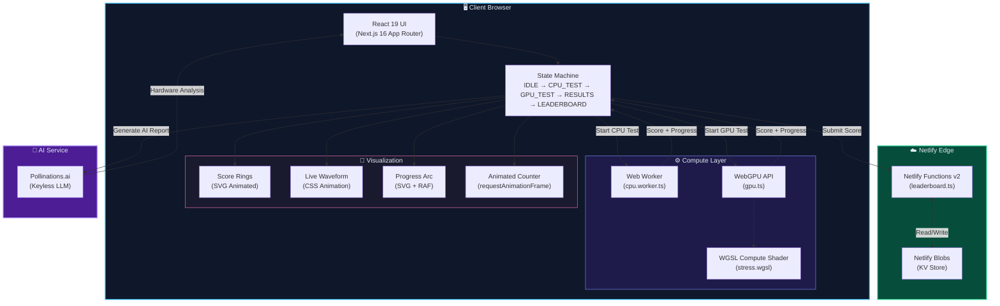
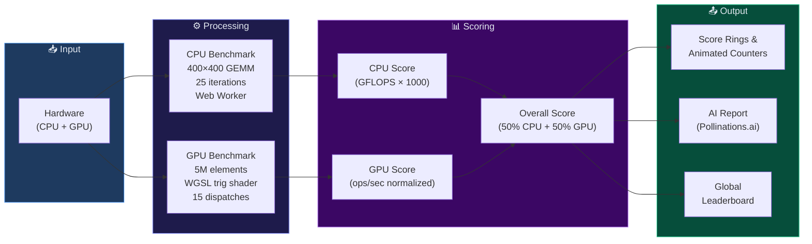

<div align="center">
  <br/>
  <h1>⚡ NanoBench</h1>
  <p><strong>Precision hardware intelligence, in your browser.</strong></p>
  <p>A fully client-side CPU & GPU benchmarking suite — zero downloads, zero signups, zero API keys.</p>
  <br/>
  <p>
    
    
    
    
    
    
  </p>
  <br/>
  <p>
    <a href="https://nanobench.netlify.app/">
      
    </a>
  </p>
  <p>
    <a href="https://github.com/praku0407/nanobench/blob/main/LICENSE.txt">
      
    </a>
    
    
  </p>
  <br/>
</div>

---

## 📋 Table of Contents

- [Overview](#-overview)
- [Live Demo](#-live-demo)
- [Features](#-features)
- [Architecture](#-architecture)
- [Tech Stack](#-tech-stack)
- [How It Works](#-how-it-works)
- [Project Structure](#-project-structure)
- [Getting Started](#-getting-started)
- [Deployment](#-deployment)
- [Browser Support](#-browser-support)
- [Contributing](#-contributing)
- [License](#-license)

---

## 🔍 Overview

**NanoBench** is a modern, browser-native hardware benchmarking platform that measures your machine's **CPU** and **GPU** performance entirely client-side. Built with Next.js 16, React 19, and WebGPU, it delivers real-time, precise hardware profiling without requiring any downloads, installations, or account creation.

Run a single benchmark and instantly receive:

| Metric | Description |
|---|---|
| 🧠 **CPU Score** | Matrix multiplication via Web Workers — measured in effective GFLOPS |
| 🎮 **GPU Score** | Heavy trigonometric compute shader dispatched through WebGPU across 15 iterations |
| ⚡ **Overall Score** | Weighted combination (50/50) of CPU and GPU performance |
| 🤖 **AI Analysis** | Clinical-grade hardware breakdown powered by Pollinations.ai (keyless LLM) |
| 🏆 **Global Leaderboard** | Submit scores and compete worldwide — persisted in Netlify Blobs |

---

## 🌐 Live Demo

**👉 [https://nanobench.netlify.app](https://nanobench.netlify.app)**

Open in **Chrome** or **Edge** (WebGPU required) and hit **Start Benchmark**. No install, no account, no API key.

---

## ✨ Features

- **🚀 Zero-Install Benchmarking** — Runs entirely in the browser, no downloads needed
- **🧵 Multi-Threaded CPU Testing** — Leverages Web Workers for non-blocking matrix multiplication
- **⚡ WebGPU Compute Shaders** — Dispatches WGSL shaders directly to the GPU for raw compute measurement
- **🤖 AI-Powered Analysis** — Automated hardware profiling via Pollinations.ai's free LLM endpoint
- **🏆 Global Leaderboard** — Serverless score persistence via Netlify Functions + Blobs
- **📊 Animated Score Rings** — Real-time animated progress arcs and score visualizations
- **📱 Fully Responsive** — Optimized for desktop, tablet, and mobile viewports
- **🎨 Dark-Mode UI** — Sleek, modern interface with Framer Motion animations

---

## 🏗 Architecture

### High-Level System Architecture



### Benchmark Execution Flow

```mermaid
sequenceDiagram
    participant U as User
    participant UI as React UI
    participant W as Web Worker
    participant G as WebGPU API
    participant S as WGSL Shader
    participant AI as Pollinations.ai
    participant NF as Netlify Functions
    participant NB as Netlify Blobs

    U->>UI: Click "Start Benchmark"
    UI->>UI: Set state → CPU_TEST
    
    rect rgb(30, 41, 59)
        Note over UI,W: Phase 1: CPU Benchmark
        UI->>W: postMessage({type: 'START_CPU_TEST'})
        loop 25 Iterations
            W->>W: 400×400 Matrix Multiply (GEMM)
            W-->>UI: Progress update
        end
        W-->>UI: {type: 'COMPLETE', score: cpuScore}
        UI->>UI: Terminate worker
    end
    
    rect rgb(30, 27, 75)
        Note over UI,S: Phase 2: GPU Benchmark
        UI->>UI: Set state → GPU_TEST
        UI->>G: requestAdapter({powerPreference: 'high-performance'})
        G-->>UI: GPUAdapter
        UI->>G: requestDevice()
        G-->>UI: GPUDevice
        UI->>G: fetch('/shaders/stress.wgsl')
        UI->>G: createShaderModule(shaderCode)
        UI->>G: createComputePipeline()
        loop 15 Iterations
            UI->>S: dispatchWorkgroups(78125)
            S->>S: 5M elements × trig stress loop
            S-->>UI: GPU queue complete
            UI-->>UI: Progress update
        end
        UI->>UI: Calculate GPU score from timing
    end

    UI->>UI: overall = (cpu × 0.5) + (gpu × 0.5)
    UI->>UI: Set state → RESULTS
    
    rect rgb(76, 29, 149)
        Note over UI,AI: Phase 3: AI Analysis (Optional)
        U->>UI: Click "Analyze with AI"
        UI->>AI: POST /openai (prompt with scores)
        AI-->>UI: Hardware analysis report
    end

    rect rgb(6, 78, 59)
        Note over UI,NB: Phase 4: Leaderboard (Optional)
        U->>UI: Enter username → Submit
        UI->>NF: POST /api/leaderboard
        NF->>NB: store.setJSON(id, scoreRecord)
        NB-->>NF: Stored
        NF-->>UI: {success: true}
        UI->>NF: GET /api/leaderboard
        NF->>NB: store.list() + store.get()
        NB-->>NF: All entries
        NF-->>UI: Top scores (sorted)
    end
```



### Data Flow Architecture



---

## 🛠 Tech Stack

| Layer | Technology | Purpose |
|---|---|---|
| **Framework** | [Next.js 16](https://nextjs.org/) | App Router, Turbopack, SSR/SSG |
| **UI Library** | [React 19](https://react.dev/) | Component-driven UI with hooks |
| **Language** | [TypeScript](https://www.typescriptlang.org/) | Type-safe development |
| **Styling** | [Tailwind CSS 4](https://tailwindcss.com/) | Utility-first CSS framework |
| **GPU Compute** | [WebGPU](https://www.w3.org/TR/webgpu/) + [WGSL](https://www.w3.org/TR/WGSL/) | GPU compute shader dispatch |
| **CPU Compute** | [Web Workers](https://developer.mozilla.org/en-US/docs/Web/API/Web_Workers_API) | Non-blocking matrix multiplication |
| **Animation** | [Framer Motion](https://motion.dev/) | Fluid UI transitions |
| **Serverless** | [Netlify Functions](https://docs.netlify.com/functions/overview/) v2 | Leaderboard API endpoints |
| **Storage** | [Netlify Blobs](https://docs.netlify.com/blobs/overview/) | Serverless key-value score persistence |
| **AI** | [Pollinations.ai](https://pollinations.ai/) | Free, keyless LLM for hardware analysis |
| **Hosting** | [Netlify](https://www.netlify.com/) | Edge deployment with CDN |

---

## 🔬 How It Works

### CPU Benchmark — Matrix Multiplication via Web Workers

The CPU benchmark runs a computationally intensive **General Matrix Multiply (GEMM)** operation inside a dedicated Web Worker to avoid blocking the main thread:

- **Matrix Size**: 400 × 400 (`Float32Array`)
- **Iterations**: 25 passes
- **Algorithm**: Classic O(N³) triple-nested loop multiplication
- **Scoring**: `GFLOPS = (2 × N³ × iterations) / (duration_seconds × 10⁹) × 1000`

```typescript
// Simplified from cpu.worker.ts
const MATRIX_SIZE = 400;
const ITERATIONS = 25;
const A = new Float32Array(MATRIX_SIZE * MATRIX_SIZE);
const B = new Float32Array(MATRIX_SIZE * MATRIX_SIZE);

// O(N³) dense matrix multiply per iteration
for (let iter = 0; iter < ITERATIONS; iter++) {
  for (let i = 0; i < MATRIX_SIZE; i++)
    for (let j = 0; j < MATRIX_SIZE; j++) {
      let sum = 0;
      for (let k = 0; k < MATRIX_SIZE; k++)
        sum += A[i * MATRIX_SIZE + k] * B[k * MATRIX_SIZE + j];
    }
}
```

### GPU Benchmark — WebGPU Compute Shader Dispatch

The GPU benchmark dispatches a WGSL compute shader that performs heavy trigonometric stress-testing:

- **Data Size**: 5,000,000 `f32` elements
- **Workgroup Size**: 64 threads per workgroup → 78,125 workgroups per dispatch
- **Iterations**: 15 GPU dispatch passes
- **Shader Workload**: Repeated `sin()`, `cos()`, `fma()` operations per element

```wgsl
// From stress.wgsl
@group(0) @binding(0) var<storage, read_write> data: array<f32>;

@compute @workgroup_size(64)
fn main(@builtin(global_invocation_id) global_id: vec3<u32>) {
  let index = global_id.x;
  if (index >= arrayLength(&data)) { return; }
  
  var value = data[index];
  // Heavy trigonometric stress loop (sin, cos, fma)
  // ... repeated FMA operations to saturate GPU compute units
  data[index] = value;
}
```

### AI Analysis — Pollinations.ai Integration

After benchmarking, users can generate an AI-powered hardware analysis:

1. Scores are sent as a structured prompt to Pollinations.ai's free LLM endpoint
2. The AI acts as "NANO-OS" — a calm, clinical telemetry analyst
3. Returns a 3-sentence hardware balance assessment with bottleneck detection

### Leaderboard — Netlify Functions + Blobs

The global leaderboard is powered by a single Netlify serverless function:

- **`POST /api/leaderboard`** — Validates and stores score entries as JSON blobs
- **`GET /api/leaderboard`** — Retrieves, sorts, and returns top scores
- **Storage**: Netlify Blobs (zero-config, serverless key-value store)

---

## 📁 Project Structure

```
nanobench/
├── 📄 netlify.toml              # Netlify build & redirect configuration
├── 📄 next.config.ts            # Next.js configuration
├── 📄 package.json              # Dependencies & scripts
├── 📄 tsconfig.json             # TypeScript configuration
├── 📄 eslint.config.mjs         # ESLint configuration
├── 📄 postcss.config.mjs        # PostCSS configuration
├── 📄 LICENSE.txt               # MIT License
│
├── 📂 netlify/
│   └── 📂 functions/
│       └── 📄 leaderboard.ts    # Serverless API (GET + POST leaderboard)
│
├── 📂 public/
│   └── 📂 shaders/
│       └── 📄 stress.wgsl       # WGSL GPU compute shader
│
└── 📂 src/
    ├── 📂 app/
    │   ├── 📄 layout.tsx        # Root layout (Geist fonts, metadata)
    │   ├── 📄 page.tsx          # Main dashboard (state machine, all UI)
    │   ├── 📄 globals.css       # Global styles + Tailwind imports
    │   ├── 📄 favicon.ico       # App icon
    │   └── 📂 workers/
    │       └── 📄 cpu.worker.ts # Web Worker for CPU benchmark
    │
    └── 📂 benchmark/
        └── 📄 gpu.ts            # WebGPU benchmark orchestrator
```

---

## 🚀 Getting Started

### Prerequisites

- **Node.js** ≥ 18.x
- **npm** or **yarn**
- A WebGPU-compatible browser (Chrome 113+, Edge 113+)

### Installation

```bash
# Clone the repository
git clone https://github.com/praku0407/nanobench.git
cd nanobench

# Install dependencies
npm install

# Start development server
npm run dev
```

The app will be available at **http://localhost:3000**.

### Available Scripts

| Command | Description |
|---|---|
| `npm run dev` | Start development server (Turbopack) |
| `npm run build` | Create production build |
| `npm run start` | Start production server |
| `npm run lint` | Run ESLint checks |

---

## ☁️ Deployment

NanoBench is deployed on **Netlify** with the following configuration:

```toml
# netlify.toml
[build]
  command = "npm run build"
  publish = ".next"

[[redirects]]
  from = "/api/*"
  to = "/.netlify/functions/:splat"
  status = 200
```

### Deploy Your Own

1. Fork this repository
2. Connect it to [Netlify](https://app.netlify.com/)
3. Netlify auto-detects the Next.js framework and configures the build
4. Netlify Blobs are automatically available — no database setup required

---

## 🌍 Browser Support

| Browser | WebGPU | CPU Benchmark | Full Support |
|---|:---:|:---:|:---:|
| Chrome 113+ | ✅ | ✅ | ✅ |
| Edge 113+ | ✅ | ✅ | ✅ |
| Firefox (Nightly) | ⚠️ Flag | ✅ | ⚠️ Partial |
| Safari 18+ | ⚠️ Preview | ✅ | ⚠️ Partial |
| Mobile Chrome | ❌ | ✅ | ⚠️ CPU Only |

> **Note**: WebGPU requires hardware acceleration to be enabled. The CPU benchmark works in all modern browsers.

---

## 🤝 Contributing

Contributions are welcome! Here's how you can help:

1. **Fork** the repository
2. **Create** a feature branch (`git checkout -b feature/amazing-feature`)
3. **Commit** your changes (`git commit -m 'Add amazing feature'`)
4. **Push** to the branch (`git push origin feature/amazing-feature`)
5. **Open** a Pull Request

### Ideas for Contributions

- 🧪 Add memory bandwidth benchmarks
- 📊 Historical score tracking per user
- 🌐 Browser fingerprint-based hardware detection
- 📈 Score comparison charts
- 🔧 WebGL fallback for non-WebGPU browsers

---

## 📄 License

This project is licensed under the **MIT License** — see the [LICENSE.txt](LICENSE.txt) file for details.

---

<div align="center">
  <br/>
  <p>
    <strong>Built with ❤️ by <a href="https://github.com/praku0407">praku0407</a> & <a href="https://github.com/p04pranav">p04pranav</a></strong>
  </p>
  <p>
    <a href="https://nanobench.netlify.app/">Live Demo</a> •
    <a href="https://github.com/praku0407/nanobench/issues">Report Bug</a> •
    <a href="https://github.com/praku0407/nanobench/issues">Request Feature</a>
  </p>
  <br/>
</div>
